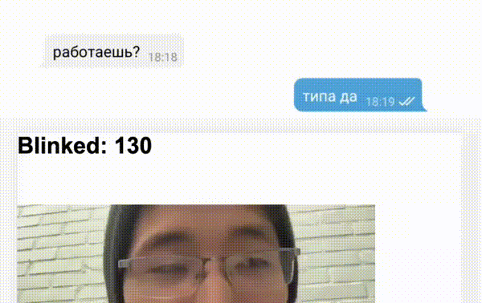

# Ender Earth

> Named after the Enderman from Minecraft — it teleports when you look at it.

A webpage that tracks your eyes — every time you blink, the 360° world around you changes.

## What's this about

Inspired by [Before Your Eyes](https://www.beforeyoureyesgame.com/) — a game where you relive memories by blinking. Each blink skips you forward in time. Days, years, a whole life flashing before your eyes.

I really wanted to play it but never got around to it, so I made my own version instead. This one uses TensorFlow.js facial landmark detection to track your eyes in real time through the webcam. When you blink, the 360° panorama teleports you to a random new scene — a field, a sunset, a road, Minecraft.

Built on top of [monolesan](https://github.com/monolesan)'s [Realless](https://realless.glitch.me/) project, with blink detection using the Eye Aspect Ratio (EAR) method on TF.js face landmarks, and [Panolens.js](https://pchen66.github.io/panolens.js/) for the 360° viewer.

## How to launch

Just open `index.html` in a browser. Needs webcam access.

Or visit the [live demo](https://nomomon.github.io/ender-earth/).

## Story

I wrote about this on my blog back in the day. The game Before Your Eyes really got to me — the idea that you're watching your memories, but every time you blink you jump forward. You can hear things, look around, but you can't hold on. Life flies by before your eyes, try not to blink it away.

It scared me honestly, because time really does move that fast. I didn't even notice two weeks had passed away from home, or how long I'd been stuck in quarantine.

I loved the concept so much — you blink in real life and the world in the game changes. If done right, it can feel seamless. I couldn't promise something as deep, but I could promise something cool. Found the neural networks I needed, found a site with a similar concept, and hacked it together as a mini-project.
